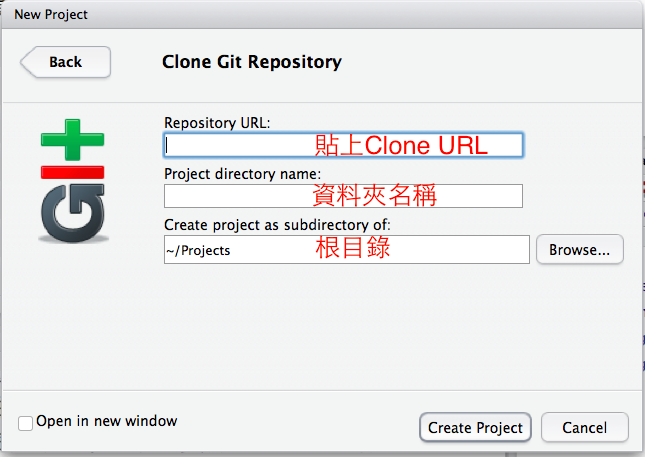
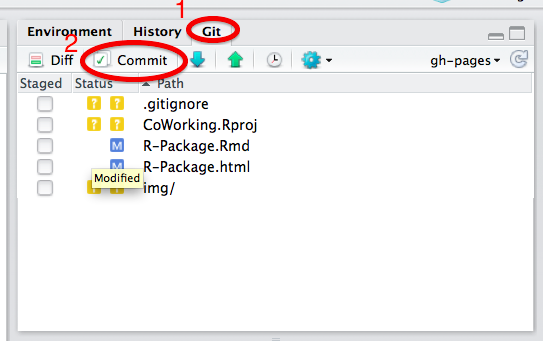
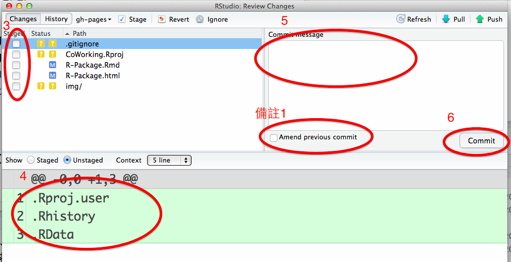

# 前製作業

- 安裝開發工具
- 可重現目前的開發成果

## 環境設定

- 安裝R v3.2.0
- 安裝[Rtools](http://cran.csie.ntu.edu.tw/bin/windows/Rtools/)
- 安裝Rstudio v0.98.1103
- 安裝Git
- 註冊Github

## 利用Git建立專案

- 瀏覽Github Project首頁並複製SSH Clone URL/HTTPS Clone URL
- 在Rstudio中建立專案：
    1. New Project
    2. Version Control
    3. Git

# 使用Git做開發

- 更改你要修正的檔案
    - 一次更改一點點
    - 每次更改後就commit
    - commit log 請不要使用中文
    - commit log 記錄簡潔的記錄更改的目的

# 細解commit

1. 點選Git分頁
2. 點選Commit
3. 勾選要Commit的檔案
4. 檢查更動的部分是否正確
5. 輸入commit log
6. commit

備註1. `amend previous commit`會覆蓋掉最後一次的commit

# 細解push

- 如果push是灰色的，請重新建立專案
- 如果工作需要push之後才能被其他人使用
- push之後請不要`amend previous commit`
- push之後請不要`amend previous commit`
- push之後請不要`amend previous commit`
- push出錯請不要緊張，通常都需要先pull之後才能push

# 細解pull

- 如果pull是灰色的，請重新建立專案
- 工作之前請務必先pull再開始
- pull如果遇到conflict，請依照下列方式解決：
Reference: <https://help.github.com/articles/resolving-merge-conflicts/>

